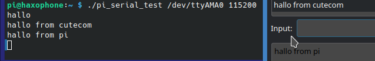

# Example 2: Serial Test
The source of this code is taken with many thanks from [https://github.com/de-vri-es/serial2-rs/blob/main/examples/serial-cat.rs](https://github.com/de-vri-es/serial2-rs/blob/main/examples/serial-cat.rs)

This program reads from the serial port and prints the result on stdout. It reads from stdin and writes to the serial port.

## Setup
We are using a haxophone with a raspberry pi zero with two connections to a ubuntu desktop pc:
1. Connect ssh over ethernet (see the haxophone manual on how to do this)
2. Connect the serial port to a serial tty usb converter:

The Haxophone HAT exposes the serial console signals on connector J4. The pins match the same pinout as pins 6,8,10 on the Raspberry Pi Header. 

Connect the haxophone with the cable in the following way (from left to right):
pin 10 - pin 8 - pin 6
UART RX - UART TX - GND --> these are the connectors on the haxophone
TXD - RXD - GND ---> this is the cable

Important note: connect RX to TX, and TX to RX

## Build and deploy
Build and deploy the program using the scripts:

```
./build.sh

./deploy.sh
```

## Run the program
In a terminal that is connected via ssh to the pi:

To run the program you first need to get the name of the serial connection:

```
[    0.000000] Kernel command line: coherent_pool=1M 8250.nr_uarts=1 snd_bcm2835.enable_headphones=0 snd_bcm2835.enable_hdmi=0 video=Composite-1:720x480@60i smsc95xx.macaddr=B8:27:EB:20:45:0E vc_mem.mem_base=0x1ec00000 vc_mem.mem_size=0x20000000  console=tty1 console=ttyAMA0,115200 root=PARTUUID=4c4e106f-02 rootfstype=ext4 fsck.repair=yes rootwait
[    0.001635] printk: console [tty1] enabled
[    2.832134] 20201000.serial: ttyAMA0 at MMIO 0x20201000 (irq = 81, base_baud = 0) is a PL011 rev2
[    3.683491] printk: console [ttyAMA0] enabled
[    8.286312] systemd[1]: Created slice system-getty.slice.
[    8.369374] systemd[1]: Created slice system-serial\x2dgetty.slice.

```

The name of the serial port we want to write to and to read from is here /dev/ttyS0

Call the programm the following way 

```
./pi_serial_test /dev/ttyAMA0 115200

```

Write something in the ssh shell on the haxophone -> it will be displayed in cutecom

Write something as input on cutecom -> it will be displayed on stdout on the haxophone




If it is not working try the following

```
./pi_serial_test /dev/ttyS0 115200
./pi_serial_test /dev/serial0 115200
./pi_serial_test /dev/serial1 115200

```

You need to check that in raspi-config the serial port is enabled, but the serial console is disabled


sudo raspi-config
Go to the enable serial port part.
Say no to console and then yes to serial.

It's useful to just go into sudo raspi-config, go to Interfaces -> Serial and answer "no", "yes" to the next two prompts. The "yes" enables the UART like you've done but the "no" part also removes the UART from the console tty.
                                                          │ 
                                          │ The serial login shell is disabled                       │ 
                                          │ The serial interface is enabled  

You can check this 

pi@haxophone:~ $ cat /boot/config.txt | grep uart
enable_uart=1

Add (see https://spellfoundry.com/2016/05/29/configuring-gpio-serial-port-raspbian-jessie-including-pi-3-4/)
core_freq=250 

pi@haxophone:~ $ cat /boot/cmdline.txt 
console=tty1 root=PARTUUID=4c4e106f-02 rootfstype=ext4 fsck.repair=yes rootwait


no serial -> ok

Sometimes a disable / enable helps:

sudo nano /boot/config.txt
enable_uart=0
reboot
enable_uart=1
reboot

and check if it works now

check that 
cat /boot/cmdline.txt 
does not contain any console entrys for ttyS0 or ttyAMA0 or serial0 e.g.
console=serial0,115200


------------
TODO neues Bsp Programm

Connect Arduino via USB
then run 

python3 -m serial.tools.list_ports -v

0x1b>[?2004hpi@haxophone:~$ <0x1b>[?2004l/dev/ttyACM0        
    desc: Seeed XIAO M0
    hwid: USB VID:PID=2886:802F SER=F14F5A295055344A322E3120FF020627 LOCATION=1-1:1.0
/dev/ttyAMA0        
    desc: ttyAMA0
    hwid: 20201000.serial
2 ports found

./pi_serial_test /dev/ttyACM0 115200


