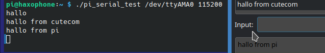

# Example 2: Serial Test
The source of this code is taken with many thanks from [https://github.com/de-vri-es/serial2-rs/blob/main/examples/serial-cat.rs](https://github.com/de-vri-es/serial2-rs/blob/main/examples/serial-cat.rs)

This program reads from the serial port and prints the result on stdout. It reads from stdin and writes to the serial port.

## Setup
We are using a haxophone with a raspberry pi zero with two connections to a ubuntu desktop pc:
1. Connect ssh over ethernet (see the haxophone manual on how to do this)
2. Connect the serial port to a serial tty usb converter:

The Haxophone HAT exposes the serial console signals on connector J4. The pins match the same pinout as pins 6,8,10 on the Raspberry Pi Header. 

Connect the haxophone with the cable in the following way (from left to right):
pin 10 - pin 8 - pin 6
UART RX - UART TX - GND --> these are the connectors on the haxophone
TXD - RXD - GND ---> this is the cable

Important note: connect RX to TX, and TX to RX

## Build and deploy
Build and deploy the program using the scripts:

```
./build.sh

./deploy.sh
```

## Run the program
In a terminal that is connected via ssh to the pi:

To run the program you first need to get the name of the serial connection:

```
pi@haxophone:~ $ dmesg | grep tty
[    0.000000] Kernel command line: coherent_pool=1M 8250.nr_uarts=1 snd_bcm2835.enable_headphones=0 bcm2708_fb.fbwidth=656 bcm2708_fb.fbheight=416 bcm2708_fb.fbswap=1 smsc95xx.macaddr=B8:27:EB:20:45:0E vc_mem.mem_base=0x1ec00000 vc_mem.mem_size=0x20000000  console=ttyAMA0,115200 kgdboc=ttyAMA0,115200 console=tty1 root=/dev/mmcblk0p2 rootfstype=ext4 rootwait
[    0.001493] printk: console [tty1] enabled
[    3.751626] 20201000.serial: ttyAMA0 at MMIO 0x20201000 (irq = 81, base_baud = 0) is a PL011 rev2
[    4.932692] printk: console [ttyAMA0] enabled
[    4.957034] 20215040.serial: ttyS0 at MMIO 0x20215040 (irq = 53, base_baud = 50000000) is a 16550
[    9.698507] systemd[1]: Created slice system-getty.slice.
[    9.728507] systemd[1]: Created slice system-serial\x2dgetty.slice.

```

The name of the serial port we want to write to and to read from is here /dev/ttyS0

Call the programm the following way 

```
./pi_serial_test /dev/ttyS0 115200
```

Write something in the ssh shell on the haxophone -> it will be displayed in cutecom

Write something as input on cutecom -> it will be displayed on stdout on the haxophone

